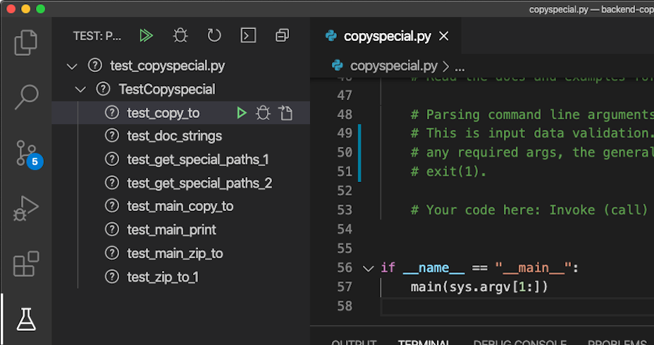
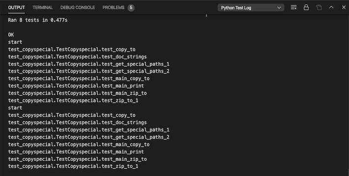

Copyspecial
===========================

Your starting point is [copyspecial.py](./copyspecial.py)

You will write functions inside of `copyspecial.py`. The `copyspecial.py` program takes one or more directories as its arguments. A "special" file is defined as one where the name contains the pattern `__w__` somewhere, where the `w` is one or more word characters. The provided `main()` function includes code to parse the command line arguments, but the rest is up to you! Write functions to implement the features below and modify main() to call your functions.

Here are some suggested functions to create in your solution (details below):

*   `get_special_paths(dir)` &mdash; returns a list of the absolute paths of the special files in the given directory
*   `copy_to(paths, dir)` &mdash; given a list of file paths, copies those files into the given directory
*   `zip_to(paths, zippath)` &mdash; given a list of file paths, zip those files up into the given zip path

Part A (manipulating file paths)
--------------------------------

Gather a list of the absolute paths of the special files in all the directories. In the simplest case, just print that list (here, the `.` after the command is a single argument indicating the current directory). Print one absolute path per line.

    % python copyspecial.py .
    /Users/daniel/Documents/github/kenzie/backend-copy-special-assessment/xyz__hello__.txt
    /Users/daniel/Documents/github/kenzie/backend-copy-special-assessment/zz__something__.jpg

We'll assume that names are not repeated across the directories (optional: check that assumption and error out if it's violated).

Part B (file copying)
---------------------

If the `--todir dir` option is present on the command line, do not print anything. Instead, copy the files to the given directory, creating the directory if necessary. Use the `shutil` standard library module for file copying.

    % python copyspecial.py --todir tmp/fooby .
    % ls tmp/fooby
    xyz__hello__.txt        zz__something__.jpg

Part C (calling an external program)
------------------------------------

If the `--tozip zipfile` option is present at the start of the command line, run this command: `zip -j zipfile <list all the files>` from within your code (the `subprocess` standard library module can help you with this). This will create a zipfile containing the files. Just for fun/reassurance, also print the command you are about to execute (e.g., `zip -j <zipfile> <each of the file paths>`). (Note to Windows users: Windows does not come with a program to produce standard .zip archives by default, but you can download the free `Zip` program [here](http://infozip.sourceforge.net/Zip.html).)

    % python copyspecial.py --tozip tmp.zip .
    Command I'm going to do:  
    zip -j tmp.zip /Users/daniel/Documents/github/kenzie/backend-copy-special-assessment/xyz__hello__.txt /Users/daniel/Documents/github/kenzie/backend-copy-special-assessment/zz__something__.jpg

If the child process exits with an error code, your program should exit, displaying the error code and printing the command's output. Test this by trying to write a zip file to a directory that does not exist.

    % python copyspecial.py --tozip /no/way.zip .
    Command I'm going to do:  
    zip -j /no/way.zip /Users/daniel/Documents/github/kenzie/backend-copy-special-assessment/xyz__hello__.txt /Users/daniel/Documents/github/kenzie/backend-copy-special-assessment/zz__something__.jpg
    
    zip I/O error: No such file or directory
    zip error: Could not create output file (/no/way.zip)

## Guidelines
 - Use the `subprocess` library to launch `zip` directly as a command line utility from within your program
 - Don't use the `zipfile` library this time
 - Your code style should be able to pass a PEP8 (flake8) test
 - Indents should be 4 **spaces** (not 2)
 - Variable names should be well chosen and meaningful and should be in *snake_case*
 - Include docstrings as the first line of a function
 
## Testing your code
Use the VS Code debugger for this assignment &mdash; the debugger is your primary tool as a developer. Have you heard of a carpenter that doesn't know how to use his own hammer? Would you hire that guy? If you need help on this assessment, *be sure you are able to run it in the debugger before asking for help from a coach*.

This assignment contains a `tests` folder that will test your code in several different ways. Make sure you are passing all the tests before you submit your work! There are a couple of ways to test.
 - From the command line:
   `% python -m unittest discover`
 - Using the built-in TDD framework of VS Code. Read [this article](https://code.visualstudio.com/docs/python/testing) and understand how to enable the framework in your VS Code IDE. Once the framework is enabled, you can run and debug any of the tests individually.
 
 To view the detailed results of the test output, select the OUTPUT tab in your integrated terminal window, and then choose "Python Test Log" in the dropdown.
 

## PR (Pull Request) Workflow for this assignment
1. *Fork* this repository into your own personal GitHub account.
2. *Clone* your own repo to your local development machine.
3. Create a separate branch named `dev` and checkout the branch.
5. Commit your changes, then `git push` the branch back to your own GitHub account.
5. From your own GitHub repo, create a pull request (PR) *from your `dev` branch back to **your own** master*.
6. Copy/Paste the URL **link to your PR** as your assignment submission.
7. Your grader will post code review comments inline within your pull request in your GitHub account. Be sure to respond to any comments and make requested changes. **RESUBMIT** a new link to your PR after making changes. This is the code review iteration cycle.
